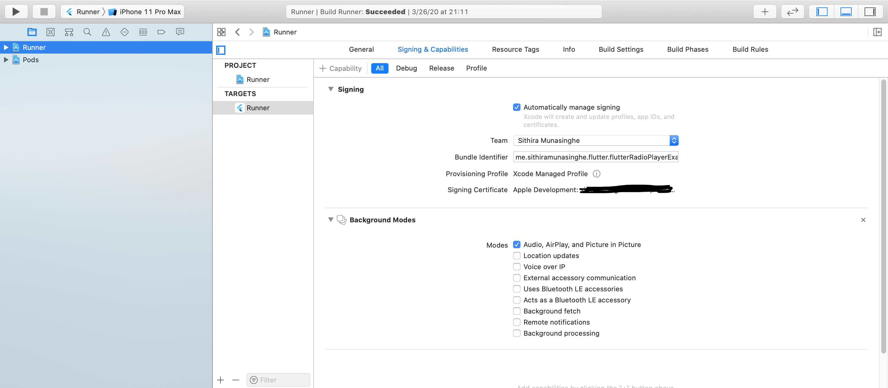

# 

Flutter radio plugin handles a single streaming media preciously. This plugin was developed with maximum usage in mind.
Flutter Radio player enables Streaming audio content on both Android and iOS natively, as an added feature this plugin supports
background music play as well. This plugin also integrate deeply with both core media capabilities such as MediaSession on Android and
RemoteControl capabilities (Control Center) on iOS. This plugin also support controlling the player via both wearOS and WatchOS.

## Features
* Supports both android and ios
* Supports background music playing
* Integrates well with watchOS and WearOS.
* Handles network interruptions.
* Reactive
* Developer friendly (Logs are placed though out the codebase, so it's easy to trace a bug)

## Reactivity ?
Unlike any other Music Playing plugin Flutter Radio Player is very reactive. It communicates with the native layer using Event and Streams, this
making the plugin very reactive to both Application (Flutter) side and the native side.

### Plugin events
This plugin utilises Android LocalBroadcaster and iOS Notification center for pushing out events. Names of the events are listed below.

* `flutter_radio_playing`
* `flutter_radio_paused`
* `flutter_radio_stopped`
* `flutter_radio_error`
* `flutter_radio_loading`

## Getting Started

1. Add this to your package's pubspec.yaml file 
```yaml
dependencies:
  flutter_radio_player: ^1.X.X
```
2. Install it
```shell script
$ flutter pub get
```
3. Import it
```dart
import 'package:flutter_radio_player/flutter_radio_player.dart';
```

4. Configure it
Creat a new instance of the player. An `FlutterRadioPlayer` instance can play a
single audio stream at a time. To create it, simply call the constructor.
However DO NOT make multiple instances of the service as FRP is using a `FOREGROUND SERVICE` to keep itself 
live when you minimize the application in `Android`.
````dart
FlutterRadioPlayer _flutterRadioPlayer = new FlutterRadioPlayer();
````
When you have an FRP instance you may simply call the `init` method to invoke the platform specific player preparation. 
For the API please reffer [FRP API](https://pub.dev/documentation/flutter_radio_player/latest/).

```dart
await _flutterRadioPlayer.init("Flutter Radio Example", "Live", "URL_HERE", "true");
```

After player preparation you may simply call `playOrPause` method to toggle audio stream.

```dart
await _flutterRadioPlayer.playOrPause();
```

FRP does allow you to change the URL after player initialized. You can simply change the stream url by calling `setUrl` on FRP object.
```dart
await _flutterRadioPlayer.setUrl('URL_HERE', "false");
```
calling above method will cause the existing URL to pause and play the newly set URL. Please refer the [FRP API](https://pub.dev/documentation/flutter_radio_player/latest/) for api documentation.

Besides above mentioned method, below are the methods that FRP exposes.
* ```stop()``` - Will stop all the streaming audio streams and detaches itself from `FOREGROUND SERVICE`. You need to reinitialize to  use the plugin again, 
```dart
await _flutterRadioPlayer.stop()
``` 
* ```start()``` - Will start the audio stream using the initialized object.
```dart
await _flutterRadioPlayer.start()
``` 
* ```pause()``` - Will pause the audio stream using the initialized object.
```dart
await _flutterRadioPlayer.pause()
``` 

Now that's not all. This plugin handles almost everything for you when it comes to `playing a single stream of audio`. From Player meta details to network interruptions,
FRP handles it all with a sweat. Please refer the example to get an idea about what FRP can do.

## iOS and Android Support
If the plugin is failing to initiate, kindly make sure your permission for background processes are given for your application

For your Android application you might want to add permissions in `AndroidManifest.xml`. This is already added for in the library level.
```xml
    <!--  Permissions for the plugin  -->
    <uses-permission android:name="android.permission.FOREGROUND_SERVICE" />
    <uses-permission android:name="android.permission.INTERNET" />

    <!--  Services for the plugin  -->
    <application android:usesCleartextTraffic="true">
        <service android:name=".core.StreamingCore"/>
    </application>
```

For your iOS application you need to enable it like this



## Support
Please hit a like to plugin on pub if you used it and love it. put a ⭐️ my GitHub [repo](https://github.com/Sithira/FlutterRadioPlayer) and show me some ♥️ so i can keep working on this.

### Found a bug ?
Please feel free to throw in a pull request. Any support is warmly welcome.
 
 

